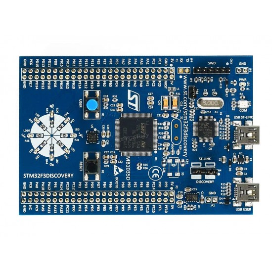
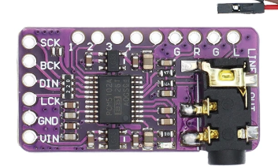
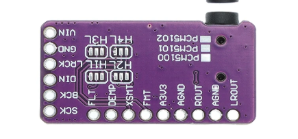
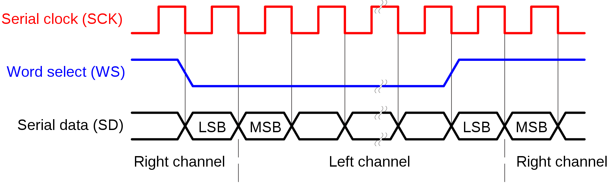
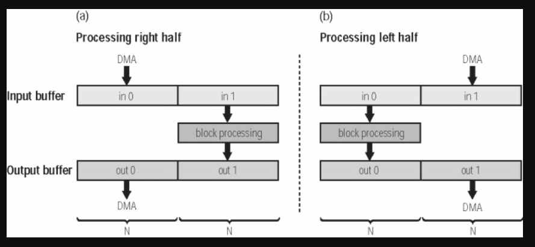

# Real-Time Embedded Digital Synthesizer on STM32

This repository contains a real-time monophonic digital synthesizer built around an **STM32F3Discovery** board and an external **PCM5102A audio DAC**. A MIDI keyboard controls the synthesizer through a small Python bridge, while the STM32 generates and processes the audio signal before sending it to the DAC over I2S.

The project originally started as the final project for the **Computer Architecture and Design** course, taught by **Professor Nicola Mazzocca** at the **University of Naples Federico II**, as part of the **Master's Degree in Computer Engineering**, academic year **2024/2025**. The original course version was developed together with my colleague **Mirko Fanini**. After the exam, I continued and expanded the project with additional DSP features, improved real-time diagnostics, signal analysis tools and a more modular software architecture.

Authors: **Antonio Maria Improta**.


## Project overview

The complete signal path is:

```text
MIDI keyboard
      |
      v
Python MIDI-to-serial bridge
      |
      v
USART interrupt and MIDI parser
      |
      v
DDS oscillator -> ADSR envelope -> TPT-SVF low-pass filter
      |
      v
Saturation and 16-bit PCM conversion
      |
      v
DMA circular buffer -> I2S -> PCM5102A -> audio output
```

Main features:

- monophonic architecture;
- sine, square and saw waveforms;
- 32-bit Direct Digital Synthesis phase accumulator;
- 1024-sample wavetables with optional linear interpolation;
- mipmapped wavetable anti-aliasing for square and saw waves;
- per-sample ADSR amplitude envelope;
- TPT State Variable Filter in low-pass mode;
- MIDI control of filter cutoff, resonance and ADSR parameters;
- stereo 16-bit PCM output at a nominal sample rate of 48 kHz;
- I2S transmission using DMA and double buffering;
- real-time cycle and deadline diagnostics.

## Hardware

The STM32F3Discovery was selected because it was the development board provided and used during the course. Its STM32F303VCT6 microcontroller was also suitable for the project because it provides I2S, DMA, USART and a hardware floating-point unit for real-time DSP.

<p align="center">
  
  
</p>

The main hardware components are:

- **STM32F3Discovery**, based on the STM32F303VCT6 microcontroller;
- **PCM5102A DAC module** with a stereo analog output;
- USB MIDI keyboard;
- PC running the MIDI-to-serial Python script;
- headphones, active speakers or an audio interface connected to the DAC output.

### STM32F3Discovery to PCM5102A connections

| Connection | STM32F3Discovery pin | PCM5102A pin | Function |
|:---:|:---:|:---:|---|
| I2S word select | **PB12** (`I2S2_WS`) | **LCK / LRCK** | Selects the left or right audio channel |
| I2S bit clock | **PB13** (`I2S2_CK`) | **BCK** | Clocks each transmitted audio bit |
| I2S audio data | **PB15** (`I2S2_SD`) | **DIN** | Carries the 16-bit PCM samples |
| Power | **5 V** | **VIN** | Powers the PCM5102A breakout board |
| Common reference | **GND** | **GND** | Provides a shared electrical ground |
| Master-clock setting | **GND** | **SCK** | The breakout board operates without an external master clock |
| Output enable | **3.3 V** | **XSMT / XMT** | Keeps the DAC output active and unmuted |

The PCM5102A produces the final analog stereo signal on its line output connector. The synthesizer currently sends the same sample to the left and right channels.

<p align="center">
  
</p>

## MIDI input

The project was tested with a **Novation Launchkey 49 MK3**. The script [`Python/Python_MIDI_TO_SERIAL.py`](Python/Python_MIDI_TO_SERIAL.py) reads messages from the keyboard and forwards Note On, Note Off and Control Change messages to the STM32 through a serial connection at **115200 baud**.

The MIDI port name and the Control Change numbers assigned to knobs or sliders may vary with the keyboard model and its configuration. When using a different controller, `MIDI_PORT` in the Python script and the firmware CC mapping may need to be updated.

On the microcontroller, USART1 receives one byte at a time using an interrupt. The interrupt callback places each byte in a ring buffer and immediately restarts reception. The main loop calls the MIDI parser when data is available, so message decoding does not take place inside the interrupt handler.

The parser supports MIDI running status and recognizes:

- Note On;
- Note Off;
- Note On with velocity zero as Note Off;
- Control Change.

### Default MIDI control mapping

| MIDI CC | Parameter |
|---:|---|
| 21 | Filter cutoff |
| 22 | Filter resonance / Q |
| 71 | ADSR attack |
| 72 | ADSR decay |
| 73 | ADSR sustain |
| 74 | ADSR release |

Filter cutoff is mapped logarithmically from 40 Hz to 16 kHz. Resonance is mapped logarithmically from Q = 0.5 to Q = 8.

### Changing the MIDI mapping

The firmware mapping is centralized in the `midi_cc_map` table in [`ST/STM32F3_Embedded_Synth/Core/Src/midi_mapping.c`](ST/STM32F3_Embedded_Synth/Core/Src/midi_mapping.c):

```c
static const MidiCCMapping midi_cc_map[] = {
    {21U, SYNTH_PARAM_FILTER_CUTOFF},
    {22U, SYNTH_PARAM_FILTER_RESONANCE},
    {71U, SYNTH_PARAM_ATTACK},
    {72U, SYNTH_PARAM_DECAY},
    {73U, SYNTH_PARAM_SUSTAIN},
    {74U, SYNTH_PARAM_RELEASE}
};
```

The first value is the MIDI CC number and the second identifies the synthesizer parameter. For example, assigning filter cutoff to CC 30 only requires changing the first row to:

```c
{30U, SYNTH_PARAM_FILTER_CUTOFF},
```

The ADSR and filter modules receive their own parameter identifiers and remain independent from the MIDI controller numbers.

## Audio output, DMA and interrupts

The STM32 operates as the I2S master transmitter. I2S2 sends 16-bit samples to the PCM5102A using three signals:

- **BCK** clocks each audio bit;
- **LRCK/WS** selects the left or right channel;
- **DIN** carries the PCM sample data.

<p align="center">
  
</p>

The audio buffer contains interleaved stereo samples:

```text
left 0, right 0, left 1, right 1, ...
```

DMA1 Channel 5 transfers this buffer from memory to the I2S peripheral in circular mode. The CPU does not need to write every sample directly to the peripheral.

The buffer is divided into two halves. Two DMA callbacks keep the audio stream running:

- the half-transfer callback refills the first half while DMA transmits the second half;
- the transfer-complete callback refills the second half while DMA transmits the first half.

This method is commonly called **double buffering** or **ping-pong buffering**. It allows the CPU and DMA controller to work on different parts of the same buffer at the same time.

<p align="center">
  
</p>

Each half-buffer contains 256 stereo frames. At 48 kHz, the firmware has approximately 5.33 ms to prepare the next half before DMA needs it.

## DSP implementation

The firmware and DSP code are divided into small modules under `ST/STM32F3_Embedded_Synth/Core`. The `midi_mapping` module translates incoming CC numbers into ADSR or filter parameters:

```text
Core/Inc                         Core/Src
├── audio_config.h               ├── oscillator.c
├── oscillator.h                 ├── oscillator_tables.c
├── oscillator_tables.h          ├── adsr.c
├── adsr.h                       ├── svf_filter.c
├── svf_filter.h                 └── midi_mapping.c
└── midi_mapping.h
```

### DDS oscillator

The oscillator uses a 32-bit phase accumulator. For every output sample, the firmware adds a phase increment:

```text
phase increment = frequency * 2^32 / sample rate
```

The ten most significant phase bits select one of the 1024 wavetable entries. This keeps the frequency resolution much higher than the wavetable size alone would allow.

The oscillator supports two table-reading methods:

- **nearest sample**, which directly reads one table entry;
- **linear interpolation**, which uses the lower phase bits to estimate the value between two adjacent entries.

Linear interpolation reduces the error caused by the finite table resolution. It does not replace anti-aliasing, but it gives a more accurate reconstruction of the stored waveform.

### Band-limited mipmapped wavetables and anti-aliasing

A single naive saw or square table contains harmonics that become invalid when the fundamental frequency increases. Harmonics above the Nyquist frequency fold back into the audible range and produce aliasing.

The anti-aliasing method adopted for the saw and square oscillators is a bank of **band-limited mipmapped wavetables**. The firmware contains nine table levels, and each successive level contains fewer harmonics:

```text
511, 255, 127, 63, 31, 15, 7, 3, 1
```

The firmware selects a level when the oscillator frequency changes. This prevents the oscillator from intentionally generating harmonics that would exceed the Nyquist limit and reduces audible aliasing, especially at high notes. A 90% Nyquist margin keeps the highest generated harmonic away from the theoretical limit. The tables are generated offline by [`analysis/generate_oscillator_tables.py`](analysis/generate_oscillator_tables.py) and stored as constant data in Flash.

The following variables can be changed through STM32CubeIDE Live Expressions for A/B tests:

```c
oscillator_mipmapped_enabled
wavetable_interpolation_enabled
```

| Mipmapped | Interpolation | Oscillator mode |
|---:|---:|---|
| 0 | 0 | Original naive wavetable |
| 0 | 1 | Naive wavetable with interpolation |
| 1 | 0 | Band-limited table with direct reading |
| 1 | 1 | Band-limited table with interpolation |

The sine oscillator continues to use a single wavetable because a sine wave contains only its fundamental frequency.

### ADSR envelope

The ADSR envelope controls the amplitude of each generated sample. Its four stages are:

1. attack, rising toward full level;
2. decay, falling toward the sustain level;
3. sustain, holding a constant level while the note remains active;
4. release, returning smoothly to silence.

The envelope runs once per audio sample. This avoids large changes in amplitude between audio blocks.

### TPT State Variable Filter

After the envelope, the signal passes through a low-pass Topology-Preserving Transform State Variable Filter. The filter exposes cutoff and resonance controls and updates its coefficients once per audio buffer after parameter smoothing.

The TPT structure was chosen because it behaves well when cutoff and resonance change during playback. Optional resonance gain compensation helps control the output level at high Q values.


## Real-time performance

The Cortex-M4 DWT cycle counter measures the execution time of `FillI2SBuffer()`. During the recorded stress test:

| Measurement | Result |
|---|---:|
| CPU clock | 48 MHz |
| Frames per half-buffer | 256 |
| Half-buffer deadline | 5.333 ms |
| Maximum observed cycles | 110,994 |
| Available cycles | 256,000 |
| Maximum observed processing time | 2.312 ms |
| Maximum observed CPU load | 43.36% |
| Remaining timing margin | 56.64% |
| Deadline misses | 0 |

These results show the maximum observed load during the test. They do not represent a formal worst-case execution-time proof. The test should be repeated after significant DSP changes.

More details are available in [`analysis/results/realtime_performance.md`](analysis/results/realtime_performance.md).

## Project report

A concise technical report describing the hardware architecture, firmware and DSP implementation is available here:

[Read the project report](docs/Real-Time%20Embedded%20Digital%20Synthesizer%20on%20STM32.pdf)

## Repository structure

```text
.
├── ST/STM32F3_Embedded_Synth/                  STM32CubeIDE firmware project
│   └── Core/
│       ├── Inc/                  DSP module headers
│       └── Src/                  Firmware and DSP implementations
├── Python/
│   └── Python_MIDI_TO_SERIAL.py  MIDI-to-USART bridge
├── analysis/                     Python DSP analysis and table generation
│   └── results/                  Generated plots and measurements
├── docs/                         Technical report and project images
├── requirements.txt              Python dependencies
└── SINTETIZZATORE.pptx           Original university presentation
```

The active firmware entry point is:

```text
ST/STM32F3_Embedded_Synth/Core/Src/main.c
```


## Running the project

1. Connect the STM32F3Discovery to the PCM5102A using the wiring table above.
2. Open `ST/STM32F3_Embedded_Synth` in STM32CubeIDE.
3. Build and flash the Debug or Release configuration.
4. Connect the MIDI keyboard and the STM32 ST-LINK USB port to the PC.
5. Install the Python dependencies:

   ```bash
   pip install -r requirements.txt
   ```

6. Set `SERIAL_PORT` and `MIDI_PORT` in `Python_MIDI_TO_SERIAL.py` if automatic detection does not match the local setup.
7. Run the Python script and play the MIDI keyboard.

The waveform can be changed with the configured STM32F3Discovery button. Board LEDs indicate the selected sine, square or saw waveform.

## Analysis tools

The `analysis` directory contains scripts used to compare the firmware algorithms with software simulations. The analysis covers:

- oscillator spectra;
- filter impulse and frequency responses;
- cutoff and resonance comparisons;
- generation of the mipmapped oscillator tables;
- recorded real-time performance results.

These scripts make the DSP implementation easier to verify before testing the complete signal path on hardware.

## Notes and current limitations

- The synthesizer is monophonic.
- Audio is generated as mono and duplicated on both I2S channels.
- Mipmapped tables change level without a crossfade.
- Nonlinear processing can generate additional harmonics after the oscillator.
- The serial and MIDI port names in the Python script may need to be changed for another computer.
- Hardware measurements remain important because a software simulation cannot include DAC, clock and analog-output effects.
